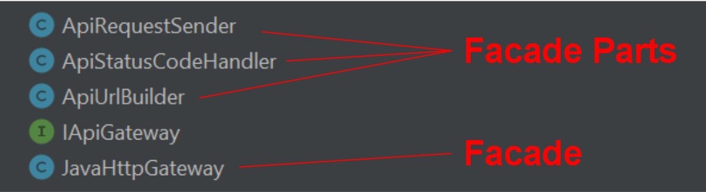
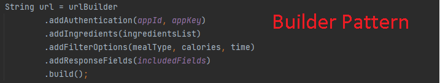

# RecipEz CSC207 Project
RecipEz as the name suggests, is an easy, all-in-one recipe generator that lets you type in ingredients one by one and then suggests recipes based on the entered ingredients.


## Specifications 
- Make sure you are using Java 11. The SDK in the project structure must use 'coretto-11' in order to run the project. 
- JUnit 4.13.1 is required to run the unit tests 

## How to Run The Program
``` shell
git clone https://github.com/CSC207-2022F-UofT/course-project-recipez.git
cd course-project-recipez
```
Then to start the RecipEz program, go to the "Main.java" file and click run.

## Design Patterns
### Facade
The JavaHttpGateway class uses a Facade design pattern. It encapsulates url building, sending requests, and handling errors into the facade. The new design is simpler for the search use case to call, which now only depends on one API gateway class. The previous design in Milestone 4 had all three components in the same search method. This method was too long, and modifications to individual components required changes in the whole class.


### Builder
The ApiUrlBuilder class uses the Builder design pattern to create the URL to make the API call. The builder has steps for appending the ingredient list, filter options, and response fields returned to the API provider’s base URL. This design simplifies the URL’s constructor and makes it easier to customize request options. In the future, more request options can be easily added, and some can be made optional without multiple constructors.


### Factory
The Fridge and User entities use the Factory design pattern in the FridgeFactory and UserFactory classes. FridgeFactory create objects of type Fridge, which CommonFridge implements. CommonUser objects are children of User, which can be created from UserFridge. In the future, different types of users or fridges can be easily added and created from UserFactory or FridgeFactory objects.

## About Us

We are the group that planned, developed, and tested the RecipEz project. 

Group members:
- [Eric Karpovits](https://github.com/EricKarpovits)
- [Shaffaan Bin Aamir](https://github.com/Shaffaan)
- [Vishwanath Wimalasena](https://github.com/fishyvishy)
- [Ricky Chen](https://github.com/rickychen175)
- [Seongmin Chang](https://github.com/takeachangs)
- [Jiahao Victor Li](https://github.com/RedFoxity)
- [Samira Dang](https://github.com/fonuxxine)
- [Jacky Yang](https://github.com/Zhuofan-Y)

