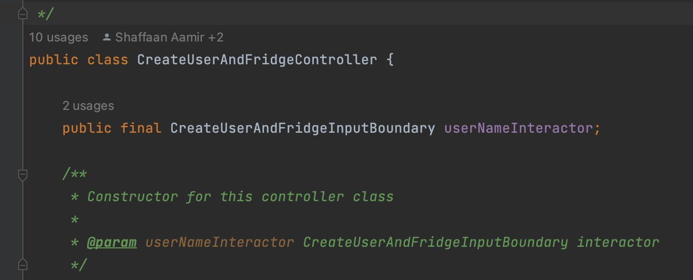

# RecipEz CSC207 Project
RecipEz as the name suggests, is an easy, all-in-one recipe generator that lets you type in ingredients one by one and then suggests recipes based on the entered ingredients.


## Specifications 
- Make sure you are using Java 11. The SDK in the project structure must use 'coretto-11' in order to run the project. 
- JUnit 4.13.1 is required to run the unit tests 

## How to Run The Program
``` shell
git clone https://github.com/CSC207-2022F-UofT/course-project-recipez.git
cd course-project-recipez
```
Then to start the RecipEz program, go to the "Main.java" file and click run.

## Design Patterns Used
### Dependency Injection:
- We have used the dependency injection in all of our use cases. Rather than creating the objects inside the classes,we pass them in as instances. One such example from our code is

- This has allowed us to create tests easily, as the dependencies can now be mocked.
- Helping this has also allowed us to adhere to clean architecture
### Facade
The JavaHttpGateway class uses a Facade design pattern. It encapsulates url building, sending requests, and handling errors into the facade. The new design is simpler for the search use case to call, which now only depends on one API gateway class. The previous design in Milestone 4 had all three components in the same search method. This method was too long, and modifications to individual components required changes in the whole class.


### Builder
The ApiUrlBuilder class uses the Builder design pattern to create the URL to make the API call. The builder has steps for appending the ingredient list, filter options, and response fields returned to the API provider’s base URL. This design simplifies the URL’s constructor and makes it easier to customize request options. In the future, more request options can be easily added, and some can be made optional without multiple constructors.


### Factory
The Fridge, Ingredient, Recipe and User entities use the Factory design pattern in the FridgeFactory, IngredientFactory, RecipeFactory and UserFactory classes. FridgeFactory create objects of type Fridge, which CommonFridge implements. This is similar to the function of IngredientFactory and RecipeFactory. CommonUser objects are children of User, which can be created from UserFridge. In the future, different types of users, ingredients, recipes or fridges can be easily added and created from UserFactory or FridgeFactory objects. 

## UML Diagram 


## User Stories With Code
- [Register Use Case] (https://github.com/CSC207-2022F-UofT/course-project-recipez/blob/main/Reports/RegisterUsecase.jpeg)
- [Enter ingredient Use case] (https://github.com/CSC207-2022F-UofT/course-project-recipez/blob/main/Reports/EnterIngredientsUsecase.jpeg)
- [Search Use Case] (https://github.com/CSC207-2022F-UofT/course-project-recipez/blob/main/Reports/SearchUseCase.png)


## Updates since Milestone 4

- **Functionality**: ResultsPage completed and intended program functionality from Registration to final search results displayed has been completed.
- **Pull Requests**: Pull requests made for completing functionality, cleaning code, and tests were made with meaningful comments.
- **Code Organization**: Merged duplicate use_cases package.
- **Testing**: Tests created for search_usecase, login_usecase, create_user_and_fridge, enter_ingredient_usecase, entities, gateway, and database.
- **Code Style and Documentation**: Removed warning from all files and Refactored package names and class names to be consistent.
- **Design Patterns**: Added Facade design pattern used in JavaHttpGateway, and Builder design pattern in ApiUrlBuilder.
- **Pull Requests**: Document highlighting  major pull requests by each user. (https://docs.google.com/document/d/1AO633xoS5uQ1Ctkh7n6KBRYmfO29UYrfxVzqHa4Qp04/edit)
 
## Github Features Used
- Issues: In milestone 1, we used the issues page to define the features in our application. As we moved through our implementation, we closed off issues, allowing us to gauge our progress and measure how our project idea changed from its initial conception. 
- Pull Requests: Once a group member pushed substantial contributions to the remote repository, they also opened a pull request in github to allow others to view the code changes. This feature was immensely helpful in managing changes to the main branch, as merging was only permitted with the approval of 3 members. Thus, all changes could be properly assessed by several reviewers to prevent erroneous merging. 
- Merge Conflict Editor: In cases where merge conflicts arose, we made use of the github editor to view the conflicts side-by-side and determine the most prudent course of action. In particular, the gradle daemon presented some merge conflicts when the GSON library was loaded into the recipe-builder branch. We made heavy use of the merge conflict editor to resolve this issue.
- Github CLI: To push, pull, fetch, and perform other git operations, we used the Github CLI. When an erroneuous action was attempted, the error messages provided insightful information, which often times, guided us directly towards a solution.
- .gitignore: Adding our storage file to the gitignore allowed us to avoid a merge conflicts due to differing storage files. 

## About Us

We are the group that planned, developed, and tested the RecipEz project. 

Group members:
- [Eric Karpovits](https://github.com/EricKarpovits)
- [Shaffaan Bin Aamir](https://github.com/Shaffaan)
- [Vishwanath Wimalasena](https://github.com/fishyvishy)
- [Ricky Chen](https://github.com/rickychen175)
- [Seongmin Chang](https://github.com/takeachangs)
- [Jiahao Victor Li](https://github.com/RedFoxity)
- [Samira Dang](https://github.com/fonuxxine)
- [Jacky Yang](https://github.com/Zhuofan-Y)
